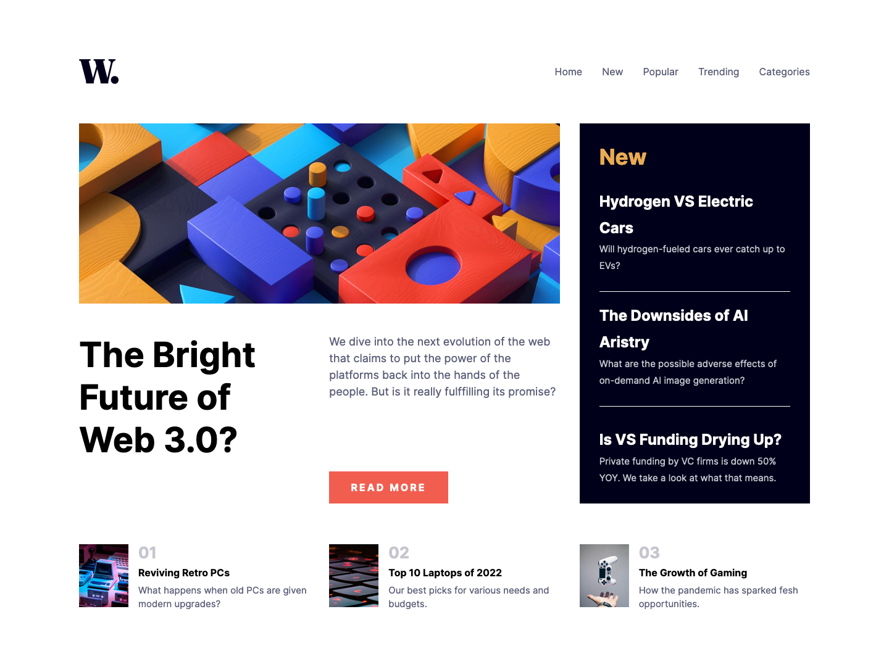
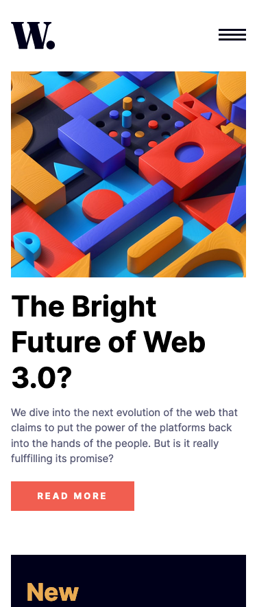
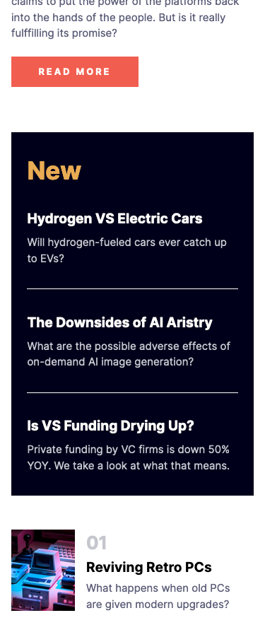
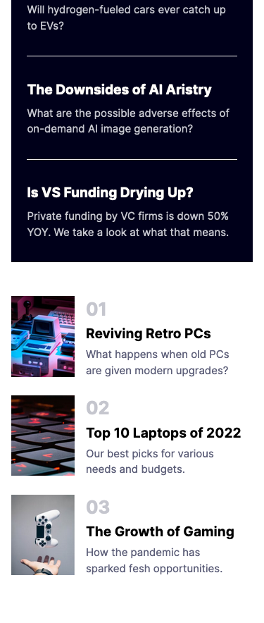
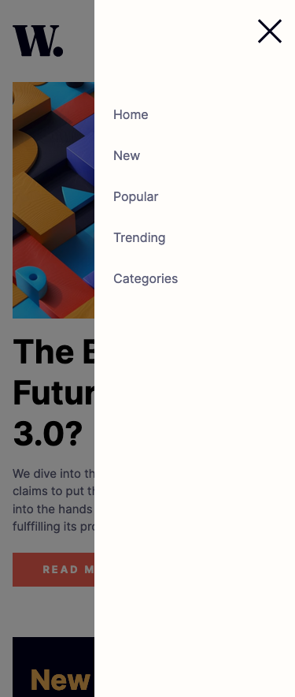

# 01_news-homepage

This is a solution to the [News homepage challenge on Frontend Mentor](https://www.frontendmentor.io/challenges/news-homepage-H6SWTa1MFl). Frontend Mentor challenges help you improve your coding skills by building realistic projects.

## Table of contents

- [Overview](#overview)
  - [The challenge](#the-challenge)
  - [Screenshot](#screenshot)
  - [Links](#links)
- [My process](#my-process)
  - [Built with](#built-with)
  - [What I learned](#what-i-learned)
  - [Continued development](#continued-development)
  - [Useful resources](#useful-resources)
- [Author](#author)
- [Acknowledgments](#acknowledgments)

## Overview

### The challenge

Users should be able to:

- View the optimal layout for the interface depending on their device's screen size
- See hover and focus states for all interactive elements on the page

### Screenshot

- Desktop: 1440px

<p float="left">
  

</p>

- Mobile: 375px

<p float="left">
  
  
   
  
</p>

### Links

- Solution URL: [Add solution URL here](https://your-solution-url.com)
- Live Site URL: [Add live site URL here](https://your-live-site-url.com)

## My process

### Built with

- React
- Vite
- SCSS
- Flexbox
- CSS Grid
- Mobile-first workflow

### What I learned

The project was very good to improve myself in using css grid. There were a few small things, like the handling of the images in a grid, which showed me different ways of handling. An example of this is the handling of images. I had the problem that the image was responsive, but always fell out of the grid. After I tried different ways like setting the width manually it worked out in the end by using the image as background-image.

To see how you can add code snippets, see below:

```jsx
<div
  className="main-preview-desktop-img"
  style={{
    backgroundImage: `url("../../../doc/news-homepage-main/assets/images/image-web-3-desktop.jpg")`,
  }}
></div>
```

This approach also allowed me to easily use the properties for the background images.

```css
.main-preview-desktop-img {
  height: 100%;
  background-size: cover;
  background-position: center;
}
```

### Continued development

Use this section to outline areas that you want to continue focusing on in future projects. These could be concepts you're still not completely comfortable with or techniques you found useful that you want to refine and perfect.

My goal with this monorepo is to become more efficient. I value accuracy, but I don't want to spend too much time on pixel-perfect spacing. What this project has definitely shown me is that I can get better at using css-grid. Especially with the nesting of the single elements I sometimes still proceeded a bit too complicated.

### Useful resources

- [grid-snippets](https://css-tricks.com/snippets/css/complete-guide-grid/) - The classic
